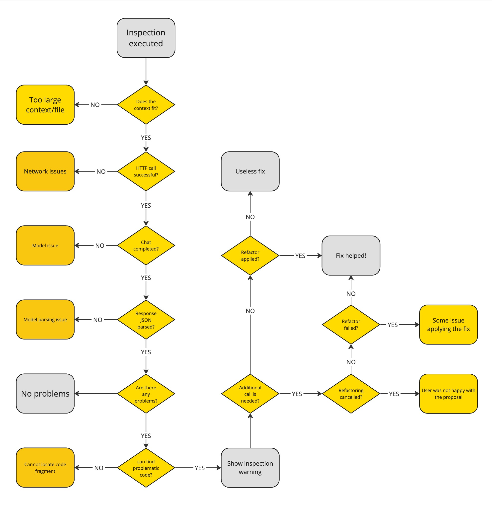

# Smart AI plugin
Just a toy project to show my skills building a plugin.

### The assignment
1. Define the scope of problems in the projects you want to address using LLM
2. Implement an inspection that spots the most complex and hard to maintain parts of the
   project.
3. Collect the required context and form the prompt
4. Implement the client to access OpenAI API https://openai.com/index/openai-api/ . and
   provide a quick-fix that addresses the problems found with the inspection with prompt(s)
   formed on the step
5. For found smelly code, provide the quickfix that 
   1. It shows the UI (it could be a simple dialog that shows the intermediate steps) to
      track the progress in the context and send a request to LLM.
   2. Apply the fix to all affected files.
6. Design the metrics service that collects the statistics/logs on the history of the interaction
   with the inspection
7. Give some insights on the metrics outcomes of the implementation and how the
   improvements influenced it.

### Solution
As a solution, the following inspections were implemented:
* **Dummy name inspection** - it searches for dummy names of the fields, variables and methods and proposes a
  better name based on context. Some notable limitations:
  * It works with java and kotlin only now (this is because of some code postprocessing after the LLM response)
  * It performs the correct rename refactoring keeping all the code consistent
* **Complexity inspection** - it analyzes all the methods in the current file and classify each in a scale from trivial 
  to very complex. For every complex method in the quick fix interface it tries to suggest the refactoring.
  * In this refactoring I apply the suggested code as text - there is no guarantee it will compile after the refactoring 
  * I see there is a way to get a structured results from LLM. I spent some time trying to support it but figured out that
  the model I used for tests doesn't support it. So to not spend much time on it I went for a solution without that feature.
> **_NOTE:_**  In order to have the plugin working you need to have a OPENAI_API_KEY env variable defined in your system.
> Then, in order to Intellij to pick it up you need to start it from shell. Alternatively, you can provide a VM option 
> (Help → Edit Custom VM Options...) `-DopenaiApiToken=...`
    
### Metrics
My main consideration was that we cannot share pieces of code with our backend (because of privacy) and so I mostly 
was focusing on tracking all the possible cases in the process (without referring to a particular code/file/prompt).
The following states are tracked:

### Tests
Because I started with dummy names inspection I spent more time to cover that functionality with tests. 
With the complexity inspection I was hurrying up. 